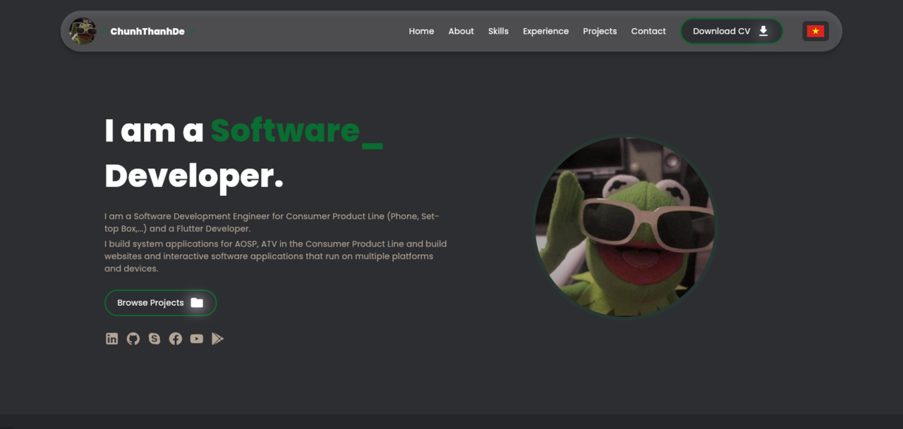
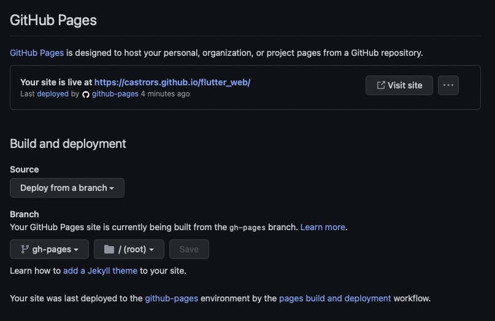

# Profhilo - ChunhThanhDe's personal website

##### Personal profile website developed by ChunhThanhDe - a software engineer, flutter developer

###### contact for work, mail: chunhthanhde.dev@gmail.com


### Welcome

<p align="center">
  
</p>
<p align="center">
  
</p>

### Screenshots



### Run Project

Alternatively, run `flutter run` and code generation will take place automatically.

### Generating Translations

To use the latest translations changes, you will need to generate them:

1. For each supported locale, add a new Folder in `i18n`.

```
├── 1i8n
│   	├── vi
│   │   └── en
```

2. Add the translated strings to each `.json` file:

`en/about.json`

```json
{
  "name": "Chung Nguyen Thanh",
  "aboutMe": "As a skilled software develope ..."
}
```

3. Configure slang.yam file:

```
base_locale: vi
input_directory: i18n
input_file_pattern: .json
output_directory: lib/generated
output_file_name: translations.g.dart
output_format: single_file
translate_var: texts
string_interpolation: double_braces
namespaces: true
```

4. Generate localizations for the current project:

To use the latest translations changes, you will need to generate them:

```sh
dart run slang build --delete-conflicting-outputs
```

### How to deploy with Github-page

I use Peanut via https://github.com/kevmoo/peanut.dart.

It's a tool that makes the application build and updates/create a gh-pages branch.

In my case, I had to follow these steps

1. Install peanut

```sh
flutter pub global activate peanut
```

2. Run the peanut command line with one extra parameter, because my repository will be available
   at https://ChunhThanhDe.github.io/flutter_web/, that is different than the default that is /, that's
   why I needed to give this base-href extra parameter too

```sh
flutter pub global run peanut --extra-args "--base-href=/flutter_web/"
```

3. In the end it will show that the gh-pages branch construction was completely successful, but you
   need to sync it in git.

```sh
git push origin --set-upstream gh-pages
```

4. Go into your repository -> Settings -> Pages and select the branch you want to build your GitHub
   page



See details here: https://dev.to/rodrigocastro_o/publishing-your-flutter-apps-into-github-pages-1l61

### Reference
Project is developed and referenced from the source: https://github.com/ericknamukolo/ericknamukolo.github.io
