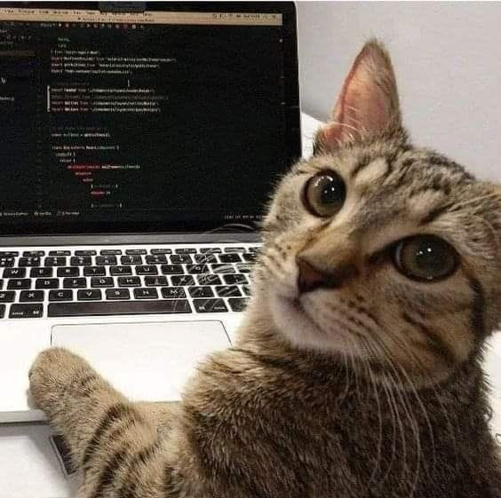

# Portfolio - ChunhThanhDe's website

Personal profile website developed by ChunhThanhDe - a software engineer, flutter developer

Show some ❤️ and star ⭐ the repo if you liked it.

###### contact for work, mail: chunhthanhde.dev@gmail.com




<a href="https://www.linkedin.com/in/chunhthanhde/">

</a>

<a href="https://www.buymeacoffee.com/chunhthanhde" target="_blank"></a>

### Welcome

<p align="center">
  
</p>
<p align="center">
  
</p>

### Screenshots


### Run Project

Alternatively, run `flutter run` and code generation will take place automatically.

### Generating Translations

To use the latest translation changes, you will need to generate them:

1. add a new Folder in `i18n` for each supported locale.

```
├── 1i8n
│   	├── vi
│   │   └── en
```

2. Add the translated strings to each `.json` file:

`en/about.json`

```json
{
  "name": "Chung Nguyen Thanh",
  "aboutMe": "As a skilled software developer..."
}
```

3. Configure slang.yam file:

```
base_locale: vi
input_directory: i18n
input_file_pattern: .json
output_directory: lib/generated
output_file_name: translations.g.dart
output_format: single_file
translate_var: texts
string_interpolation: double_braces
namespaces: true
```

4. Generate localizations for the current project:

To use the latest translation changes, you will need to generate them:

```sh
dart run slang build --delete-conflicting-outputs
```

### How to deploy with Github-page

I use Peanut via https://github.com/kevmoo/peanut.dart.

It's a tool that makes the application build and update/create a gh-pages branch.

In my case, I had to follow these steps

1. Install peanut

```sh
flutter pub global activate peanut
```

2. Run the peanut command line with one extra parameter, because my repository will be available
   at https://ChunhThanhDe.github.io/flutter_web/, which is different than the default that is /,
   that's
   why do I need to give this base-href extra parameter too

```sh
flutter pub global run peanut --extra-args "--base-href=/flutter_web/"
```

3. In the end it will show that the gh-pages branch construction was completely successful, but you
   need to sync it in git.

```sh
git push -f origin --set-upstream gh-pages
```

4. Go into your repository -> Settings -> Pages and select the branch you want to build your GitHub
   page


See details here: https://dev.to/rodrigocastro_o/publishing-your-flutter-apps-into-github-pages-1l61

### Reference

The project is developed and referenced from the
source: https://github.com/ericknamukolo/ericknamukolo.github.io
